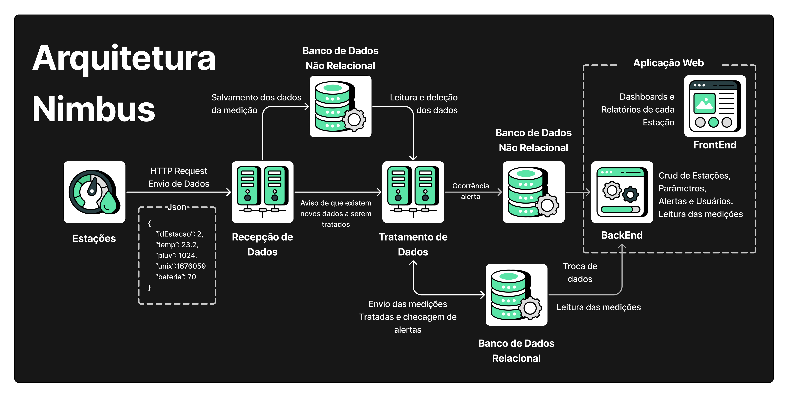

<h1 align="center">Sistema de Coleta de Dados de Estações Meteorológicas</h1>
<h2 align="center">FATEC Prof Jessen Vidal, São José dos Campos - 4º Semestre DSM 2024</h2>

    <a href="#sobre">Sobre</a> | 
    <a href="#tecnologias">Tecnologias</a> |
    <a href="#equipe">Equipe</a> | 
    <a href="#entregas">Entregas</a> | 
    <a href="#backlog">Backlog</a> |
    <a href="#arquitetura">Arquitetura</a> | 

<h1 align="center">Sobre</h1>

Esse projeto foi desenvolvido pelos alunos do 4º semestre da FATEC Prof Jessen Vidal, São José dos Campos em parceria com a empresa Tecsus.

Ele tem como objetivo a obtenção de dados meteorológicos através de sensores acoplados nas estações e disponibilizar esses dados de forma gráfica com a utilização de dashboards, para informar a população da região em que essa estação foi instalada e educar sobre a importância desses dados.

<h1 align="center">Tecnologias/Pré-Requisitos</h1>

  
  
  
  
  
  </img>
    
  

<h1 align="center">Equipe</h1>

  | Função | Foto | Nome | GitHub | LinkedIn |
  | :-: | :-: | :-: | :-: | :-: |
  | Backend Dev |  | Bruno Denardo  | [GitHub](https://github.com/brunodenardo) | [LinkedIn](https://www.linkedin.com/in/bruno-denardo/) |
  | Product Owner |  | José V. H. Lopes de Souza | [GitHub](https://github.com/HenningerJv) | [LinkedIn](https://www.linkedin.com/in/jose-victor-henninger-7661b928a/) |
  | Scrum Master |  | Matheus Fernando Vieira de Melo | [GitHub](https://github.com/Matheusfvm) | [LinkedIn](www.linkedin.com/in/matheus-melo-b09474224) |
  | Frontend Dev |  | Murilo Henrique Sangi da Silva Lima | [GitHub](https://github.com/MuriloLima03) | [LinkedIn](https://www.linkedin.com/in/murilo-sangi-062780285/) |
  | Frontend Dev |  | Renan Souza Neves | [Github](https://github.com/Renan-Neves) | [LinkedIn](https://br.linkedin.com/in/renan-neves-286735224) |
  | Frontend Dev |  | Vinicius de Oliveira Laranjeiro | [GitHub](https://github.com/noo-e) | [LinkedIn](https://www.linkedin.com/in/vinicius-laranjeiro-296b371bb) |

<h1 align="center">Entregas</h1>
O projeto tem por base a metodologia ágil SCRUM, por isso foi separado em 4 entregas com sprints de 21 dias de duração cada uma.

 

 

<b>Resultado das sprints:</b>

<b>Sprint 1</b>

 

Focada no desenvolvimento da aplicação web, mais especificamente os CRUDs de alerta, estação, usuário e parâmetro.

<b>Demonstração:</b>

<b>Burndown:</b>

<h1 align="center">Backlog</h1>

| Sprint | Funcionalidade |
| :--:   | :-----------:  |
| **01** | Cadastro de Tipo Parâmetros |
| **01** | Listagem de Tipo Parâmetros |
| **01** | Alteração de Dados de Tipo Parâmetros |
| **01** | Deleção de Tipo Parâmetros |
| **01** | Cadastro de Estações |
| **01** | Listagem de Estaçõess |
| **01** | Alteração de Dados de Estações |
| **01** | Deleção de Estações |
| **01** | Cadastro de Usuários |
| **01** | Listagem de Usuários |
| **01** | Alterações de Dados de Usuários |
| **01** | Deleção de Usuários |
| **01** | Cadastro de Alertas |
| **01** | Listagem de Alertas |
| **01** | Alteração de Dados de Alertas |
| **01** | Deleção de Alertas |
| **01** | Entrada/Login como Perfil Administrador |
| **02** | Recepção dos dados das estações meteorológicas |
| **02** | Tratamento dos dados  recebidos das medições das estações | 
| **02** | Dashboards para visualização dos parâmetros meteorológicos | 
| **03** | Tutorial para os alunos do significado de cada parâmetro meteorológico | 
| **03** | 3 relatórios com base nas estatisticas das medições |
| **03** | Disparo de Alertas | 
| **04** | Entrada/Login como Perfil Visualizador |
| **04** | Entrada/Login como Perfil Público |
| **04** | Montagem de uma estação meteorológica |

<h1 align="center">Arquitetura</h1>

A arquitetura de microserviços para monitoramento meteorológico proposta oferece uma abordagem escalável e flexível para lidar com a coleta, processamento e visualização de dados de estações meteorológicas. Aqui está uma visão geral do fluxo de dados e dos componentes envolvidos:

- **Estações Meteorológicas:** 
  As estações meteorológicas são dispositivos distribuídos em várias localizações que coletam dados meteorológicos em tempo real, como temperatura, umidade, pressão atmosférica, entre outros.

- **Microserviço de Recepção:** 
  Um microserviço dedicado recebe os dados enviados pelas estações meteorológicas. Este serviço é responsável por validar e armazenar esses dados em um banco de dados não relacional, otimizado para armazenamento de alta velocidade e escalabilidade horizontal.

- **Microserviço de Tratamento:** 
  Após receber os dados, outro microserviço entra em ação para processá-los. Este serviço é encarregado de aplicar regras de negócio e determinar se alguma medição excede os limites predefinidos, acionando alertas quando necessário. As medições que acionam alertas são armazenadas em um banco de dados não relacional para acesso rápido e análises posteriores.

- **Banco de Dados Relacional:** 
  Tanto as medições que acionam quanto as que não acionam alertas são persistidas em um banco de dados relacional. Isso permite consultas complexas e relacionamentos entre os dados, fornecendo uma base sólida para análises históricas e relatórios.

- **Frontend React:** 
  Um aplicativo frontend React oferece uma interface de usuário amigável para visualizar as medições meteorológicas e os alertas correspondentes. Ele faz solicitações ao backend Node.js para recuperar os dados necessários.

- **Backend Node.js:** 
  O backend Node.js é responsável por servir o frontend React e gerenciar todas as operações CRUD (Create, Read, Update, Delete) relacionadas aos alertas, usuários, parâmetros das medições, medições e estações meteorológicas. Ele interage com os bancos de dados subjacentes para buscar e persistir os dados conforme necessário.