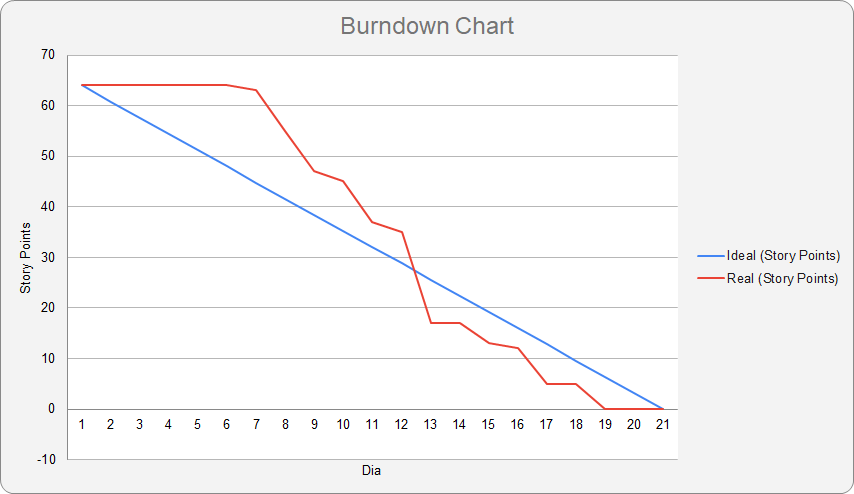
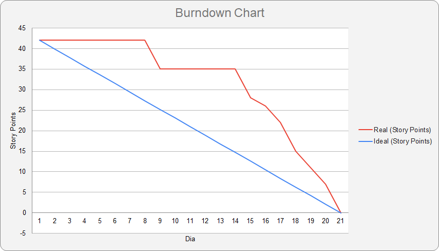
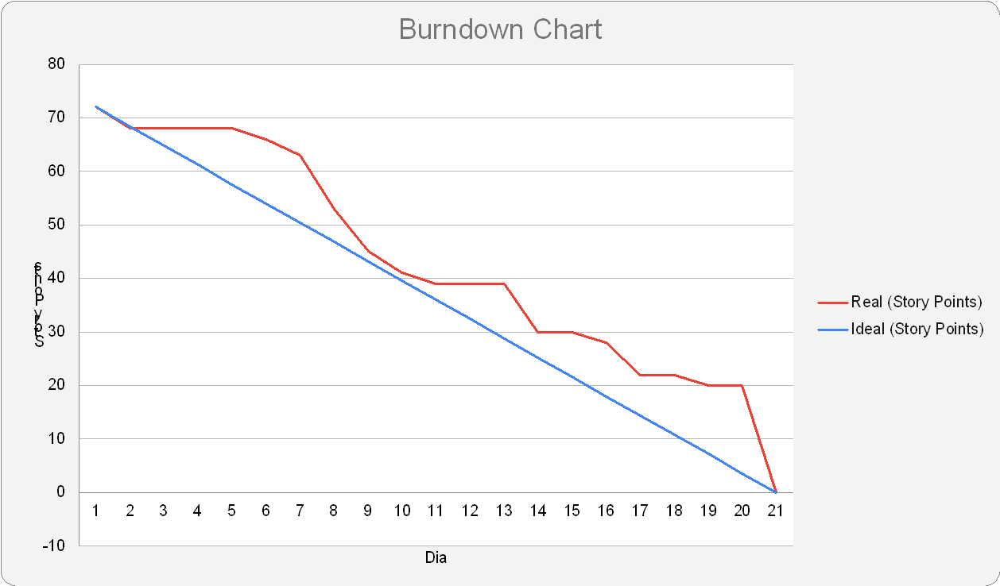

<h1 align="center">Sistema de Coleta de Dados de Estações Meteorológicas</h1>
<h2 align="center">FATEC Prof Jessen Vidal, São José dos Campos - 4º Semestre DSM 2024</h2>

    <a href="#sobre">Sobre</a> | 
    <a href="#tecnologias">Tecnologias</a> |
    <a href="#equipe">Equipe</a> | 
    <a href="#entregas">Entregas</a> | 
    <a href="#backlog">Backlog</a> |
    <a href="#arquitetura">Arquitetura</a> | 

<h1 align="center">Sobre</h1>

Esse projeto foi desenvolvido pelos alunos do 4º semestre da FATEC Prof Jessen Vidal, São José dos Campos em parceria com a empresa Tecsus.

Ele tem como objetivo a obtenção de dados meteorológicos através de sensores acoplados nas estações e disponibilizar esses dados de forma gráfica com a utilização de dashboards, para informar a população da região em que essa estação foi instalada e educar sobre a importância desses dados.

<h1 align="center">Tecnologias/Pré-Requisitos</h1>

  
  
  
  
  
  
    
  
  
  
  
  

<h1 align="center">Equipe</h1>

  | Função | Foto | Nome | GitHub | LinkedIn |
  | :-: | :-: | :-: | :-: | :-: |
  | Backend Dev |  | Bruno Denardo  | [GitHub](https://github.com/brunodenardo) | [LinkedIn](https://www.linkedin.com/in/bruno-denardo/) |
  | Product Owner |  | José V. H. Lopes de Souza | [GitHub](https://github.com/HenningerJv) | [LinkedIn](https://www.linkedin.com/in/jose-victor-henninger-7661b928a/) |
  | Scrum Master |  | Matheus Fernando Vieira de Melo | [GitHub](https://github.com/Matheusfvm) | [LinkedIn](www.linkedin.com/in/matheus-melo-b09474224) |
  | Frontend Dev |  | Murilo Henrique Sangi da Silva Lima | [GitHub](https://github.com/MuriloLima03) | [LinkedIn](https://www.linkedin.com/in/murilo-sangi-062780285/) |
  | Backend Dev |  | Pedro Henrique Silva Almeida | [GitHub](https://github.com/PedroHSdeAlmeida) | [LinkedIn](https://www.linkedin.com/in/pedroalmeidadev/) |
  | Frontend Dev |  | Vinicius de Oliveira Laranjeiro | [GitHub](https://github.com/noo-e) | [LinkedIn](https://www.linkedin.com/in/vinicius-laranjeiro-296b371bb) |

<h1 align="center">Entregas</h1>
O projeto tem por base a metodologia ágil SCRUM, por isso foi separado em 4 entregas com sprints de 21 dias de duração cada uma.

 

 

<h2>Resultado das sprints:</h2>

<h2>Sprint 1</h2>

 

Focada no desenvolvimento da aplicação web, mais especificamente os CRUDs de alerta, estação, usuário e parâmetro.

<b>Sprint Backlog:<b>

| Sprint | Funcionalidade | Prioridade |
| :--:   | :-----------:  | :--------: |
| **01** | Cadastro de Tipo Parâmetros | Alta |
| **01** | Listagem de Tipo Parâmetros | Alta |
| **01** | Alteração de Dados de Tipo Parâmetros | Alta |
| **01** | Cadastro de Estações | Alta |
| **01** | Listagem de Estaçõess | Alta |
| **01** | Alteração de Dados de Estações | Alta 
| **01** | Deleção de Tipo Parâmetros | Média ||
| **01** | Deleção de Estações | Média |
| **01** | Cadastro de Usuários | Média |
| **01** | Cadastro de Alertas | Média |
| **01** | Alteração de Dados de Alertas | Média |
| **01** | Listagem de Usuários | Baixa |
| **01** | Alterações de Dados de Usuários | Baixa |
| **01** | Deleção de Usuários | Baixa |
| **01** | Listagem de Alertas | Baixa |
| **01** | Entrada/Login como Perfil Administrador | Baixa |

<b>Demonstração:</b>

<b>Burndown:</b>

<b>Tarefas:</b>

O grupo optou pela organização das tarefas fazendo uso de épicos, User Story, tarefas e subtarefas.

Irei usar como exemplo o épico do CRUD de estação, com a User Story relacionada ao cadastro de estação

| Tipo | Descrição |
| :--:   | :-----------:  |
| **Épico** | CRUD dos objetos do tipo "estacao" |
| **User Story**| Cadastro dos objetos do tipo "estacao" |
| **Subtarefa** | (FRONT) Criar componente da tela de cadastro dos objetos do tipo "estacao" |
| **Subtarefa** | (FRONT) Estilizar o componente da tela de cadastro dos objetos do tipo "estacao" |
| **Subtarefa** | (BACK) Criar a entidade do tipo "estacao" |
| **Subtarefa** | (BACK) Criar a rota POST para cadastro dos objetos do tipo "estacao" e a função objetivo para criar os objetos desse tipo |

Houve também tarefas que não estavam relacionadas a nenhum épico ou User Story. Um exemplo disso foram as tarefas de configuração de ambiente e de correção dos testes exploratórios

| Tipo | Descrição |
| :--:   | :-----------:  |
| **Tarefa** | (FRONT) Configuração das dependências (jest, Axios, React) |
| **Tarefa** | (BACK) Configuração das dependências (jest, express, dotenv e TypeORM) |

Todas as tarefas podem ser consultadas clicando <a href = "https://docs.google.com/spreadsheets/d/1q-DvcxZ_NiTByh3u8eYzXlgmcT8N0IaQ3varae1bzhQ/edit?usp=sharing">aqui</a>

<h2>Sprint 2</h2>

 

Focada no desenvolvimento dos serviços de recepção e tratamento das medições e nos dashboards gerais e específicos de estação.

<b>Sprint Backlog:<b>

| Sprint | Funcionalidade | Prioridade |
| :--:   | :-----------:  | :--------: |
| **02** | Recepção dos dados das estações meteorológicas | Alta |
| **02** | Tratamento dos dados  recebidos das medições das estações | Alta |
| **02** | Dashboards para visualização dos parâmetros meteorológico | Média |

<b>Demonstração:</b>

<b>Burndown:</b>

<b>Tarefas:</b>

O grupo optou pela  das tarefas fazendo uso de épicos, User Story, tarefas e subtarefas.

Irei usar como exemplo o épico do da recepção do dados das estações meteorológicas

| Tipo | Descrição |
| :--:   | :-----------:  |
| **Épico** | Recepção dos dados das estações meteorológicas |
| **User Story**| Como administrador, quero receber e armazenar os dados enviados pelas estações para fornecer informações sobre o ambiente |
| **Subtarefa** | (BACK) Configurar o Banco não relacional (Mongo) para guardar os dados recebidos das estações |
| **Subtarefa** | (BACK) Criar uma rota POST e a função objetivo que irá guardar os dados das estações no MongoBD |
| **Subtarefa** | (BACK) Criar função que avisa o serviço de tratamento via axios (ou outra biblioteca) que uma nova medição foi adicionada ao banco. |

Houve também tarefas de melhoria e correção que vieram da sprint 1, principalmente relacionadas ao cadastro e alteração de estações

| Tipo | Descrição |
| :--:   | :-----------:  |
| **Tarefa** | (BACK) No cadastro de estação deve se validar os tipos parâmetros para não haver tipos parâmetros com nome nem unidades iguais no cadastro |
| **Tarefa** | (CORRECAO-BACK) Corrigir um falha na alteração de estação referente a mudança de tipo do atributo "idEstação" |
| **Tarefa** | (FRONT) No cadastro de estação não deve ser possível atrelar tipos parâmetros de nomes e unidades iguais |

Todas as tarefas podem ser consultadas clicando <a href = "https://docs.google.com/spreadsheets/d/1e4ArZZeLIIL8R2cUQ7j2FXgcxJob1i7PbtHt_gRdVrk/edit?usp=sharing">aqui</a>

<h2>Sprint 3</h2>

 

Essa sprint focou em quatro áreas da aplicação: disparos de alertas, relatórios dos dados das medições e alertas, configuração do código do embarcado e na página com os textos informativos sobre os parâmetros .

<b>Sprint Backlog:<b>

| Sprint | Funcionalidade | Prioridade |
| :--:   | :-----------:  | :--------: |
| **03** | Desenvolvimento do software do embarcado | Alta |
| **03** | Disparo de alertas | Alta |
| **03** | 3 relatórios com base nas estatisticas das medições | Média |
| **03** | Tutorial para os alunos do significado de cada parâmetro meteorológico | Baixa |

<b>Demonstração:</b>

<b>Burndown:</b>

<b>Tarefas:</b>

O grupo optou pela  das tarefas fazendo uso de épicos, User Story, tarefas e subtarefas.

Irei usar como exemplo o épico do da recepção do dados das estações meteorológicas

| Tipo | Descrição |
| :--:   | :-----------:  |
| **Épico** | Tutorial para os alunos do significado de cada parâmetro meteorológico |
| **User Story**| Como usuário do sistema, quero ter acesso à informações sobre o funcionamento das estações para compreender melhor os dados fornecidos pela estação |
| **Subtarefa** | (PESQUISA) Pesquisar e redigir um texto sobre o sensor de umidade |
| **Subtarefa** | (FRONT) Criar uma página de exibição para cada um dos textos  do tutorial e estilizar cada uma |

Houve também algumas funcionalidades que precisaram ser alteradas da sprint 2, principalmente as que envolviam a recepção dos dados de medição, devido ao embarcado

| Tipo | Descrição |
| :--:   | :-----------:  |
| **Tarefa** | (BACK) Alterar a função que confere a existência da estação, para receber o id da placa ao invés do id da estação |
| **Tarefa** | (BACK) Adicionar na entidade estação uma propriedade chamada "idPlacaEstacao" para vincular o número identificador da placa que fica na estação |
| **Tarefa** | (FRONT) Criar um campo no cadastro de estação de id da placa da estação |

Todas as tarefas podem ser consultadas clicando <a href = "https://docs.google.com/spreadsheets/d/1IQs-ZGjhDX3y9IucDF79MTZJf0MKLFNXrdh9oJKUIw8/edit?usp=sharing">aqui</a>

<h2>Sprint 4</h2>

 

Essa sprint foi focada na entrega de requisitos que precisaram ser remanejados (Relatórios, página informativas, dashboard de alertas) e em algumas correções.

<b>Sprint Backlog:<b>

| Sprint | Funcionalidade | Prioridade |
| :--:   | :-----------:  | :--------: |
| **04** | Dashboards para visualização dos parâmetros meteorológico | Alta |
| **04** | Relatório das medições máximas e mínimas dos meses do ano para cada tipo parametro da estação em questão | Média |
| **04** | Montagem de uma estação meteorológica | Média |
| **04** | Tutorial para os alunos do significado de cada parâmetro meteorológico | Baixa |

<b>Demonstração:</b>

<b>Burndown:</b>

<b>Tarefas:</b>

O grupo optou pela  das tarefas fazendo uso de épicos, User Story, tarefas e subtarefas.

Irei usar como exemplo o épico dos relatórios

| Tipo | Descrição |
| :--:   | :-----------:  |
| **Épico** | Relatório das medições máximas e mínimas dos meses do ano para cada tipo parâmetro da estação em questão |
| **User Story**| Como administrador eu quero gerar relatórios sobre as medidas recebidas para ter um histórico de suas variações |
| **Subtarefa** | (BACK) Criar uma rota GET parametrizada com os filtros de período (Data inicio e Data final) e tipo parâmetro e a função objetivo que realiza essa consulta baseada nos filtros |
| **Subtarefa** | (FRONT) Alterar o componente do dashboard específico para adicionar um tabela com os dados do relatório e adicionar dois filtros, um filtro de período (Data início - Data término) e outro de tipo parâmetro |

Houve também tarefas de melhoria e correção que vieram da sprint 1, principalmente relacionadas ao cadastro e alteração de estações

| Tipo | Descrição |
| :--:   | :-----------:  |
| **Tarefa** | (FRONT) Desenvolver a landing page do projeto |
| **Tarefa** | (CORREÇÃO-TRATAMENTO) Aplicar o offset e fator dos parâmetros aos alertas gerados |
| **Tarefa** | (BACK) Iniciar o Banco de dados com um usuário já cadastrado |
| **Tarefa** | (DEVOPS) Pesquisa sobre frameworks de testes para o front-end |

Todas as tarefas podem ser consultadas clicando <a href = "https://docs.google.com/spreadsheets/d/18PVn4amDch_QelSJZaut4dJFfgURVnnvCshF92_97kY/edit?usp=sharing">aqui</a>

<h1 align="center">Backlog</h1>

| Sprint | Funcionalidade | User Story | Prioridade |
| :--:   | :-----------:  | :--------: | :--------: |
| **01** | Cadastro de Tipo Parâmetros | US01 | Alta |
| **01** | Listagem de Tipo Parâmetros | US02 | Alta |
| **01** | Alteração de Dados de Tipo Parâmetros | US03 | Alta |
| **01** | Deleção de Tipo Parâmetros | US04 | Alta |
| **01** | Cadastro de Estações | US05 | Alta |
| **01** | Listagem de Estaçõess | US06 | Alta |
| **01** | Alteração de Dados de Estações | US07 | Alta |
| **01** | Deleção de Estações | US08 | Alta |
| **01** | Cadastro de Usuários | US09 | Média |
| **01** | Listagem de Usuários | US10 | Média |
| **01** | Alterações de Dados de Usuários | US11 | Média |
| **01** | Deleção de Usuários | US12 | Média |
| **01** | Cadastro de Alertas | US13 | Média |
| **01** | Listagem de Alertas | US14 | Média |
| **01** | Alteração de Dados de Alertas | US15 | Média |
| **01** | Deleção de Alertas | US16 |  Média  |
| **01** | Entrada/Login como Perfil Administrador | US17 | Média |
| **02** | Recepção dos dados das estações meteorológicas | US18 | Alta |
| **02** | Tratamento dos dados  recebidos das medições das estações |   US19 | Alta |
| **02** | Dashboards para visualização dos parâmetros meteorológicos | US20 | Média |
| **03** | 3 relatórios com base nas estatisticas das medições | US22 | Média |
| **03** | Disparo de Alertas | US23 | Média |
| **04** | Tutorial para os alunos do significado de cada parâmetro meteorológico | US21 | Baixa |
| **04** | Montagem de uma estação meteorológica | US26 | Baixa |

<b>User Story</b>

| User Story | Descrição |
| :--: | :-----------:  |
| US01 | Como administrador, quero cadastrar diferentes tipos de parâmetros para que eu possa atrela-los às estações de medição |
| US02 | Como administrador, quero ter acesso aos tipos de parâmetros já cadastrados para que eu saiba os tipos que já existem no sistema |
| US03 | Como administrador, quero alterar tipos de parâmetros já cadastrados para corrigir possíveis erros de cadastro |
| US04 | Como administrador, quero deletar tipos de parâmetros para não poluir a lista de parâmetros com aqueles que não são mais úteis |
| US05 | Como administrador, quero cadastrar novas estações para registrar as estações em uso |
| US06 | Como usuário do sistema, quero ter acesso às informações das estações em uso para me informar sobre quais lugares estão tendo o seu clima monitorado |
| US07 | Como administrador, quero alterar os dados das estações já cadastradas para inserir novos tipos parametros e mudar o seu local |
| US08 | Como administrador, quero deletar uma estação cadastrada para que o sistema deixe de coletar dados de uma estação já desativada |
| US09 | Como administrador, quero cadastrar novos administradores para me ajudar no gerenciamento do sistema |
| US10 | Como administrador, quero ver quais usuários estão cadastrados no sistema para gerenciar quem tem acesso à funcionalidades mais protegidas |
| US11 | Como administrador, quero alterar dados de usuários já cadastrados para corrigir possíveis erros de cadastro |
| US12 | Como administrador, quero deletar usuários já cadastrados para para tirar o acesso desses usuários a funcionalidades protegidas do sistema |
| US13 | Como administrador, quero cadastrar alertas de medição para para ser avisado de situações climáticas perigosas |
| US14 | Como administrador, quero acessar os alertas já cadastrados para saber quais alertas já existem e gerenciá-los |
| US15 | Como administrador, quero alterar um alerta já cadastrado para corrigir possíveis erros no cadastro |
| US16 | Como administrador, quero deletar alertas cadastrados para para eliminar alertas que já não são úteis |
| US17 | Como administrador, quero logar no sistema para gerenciar as funcionalidades das estações |
| US18 | Como administrador, quero receber e armazenar os dados enviados pelas estações para fornecer informações sobre o ambiente |
| US19 | Como administrador, quero receber e tratar os dados das estações para dar informações mais precisas para o usuário do sistema" |
| US20 | Como usuário do sistema, quero ter acesso a um dashboard que permita a visualização dos dados meteorológicos para acompanhar as condições climáticas de forma intuitiva |
| US21 | Como usuário do sistema, quero ter acesso à informações sobre o funcionamento das estações para compreender melhor os dados fornecidos pela estação |
| US22 | Como admnistrador, quero gerar relatórios sobre as medidas recebidas para ter um histórico de suas variações |
| US23 | Como usuário do sistema, quero receber alertas de medidas que ultrapassarem os parâmetros esperados para estar ciente de situações críticas |
| US24 | Como usuário visualizador, quero entrar no sistema para acessar informações das estações |
| US25 | Como usuário público, quero entrar no sistema para acessar informações do tempo |
| US26 | Como administrador, quero montar uma estação meteorológica para fazer medições reais do ambiente |

<h1 align="center">Arquitetura</h1>

A arquitetura de microserviços para monitoramento meteorológico proposta oferece uma abordagem escalável e flexível para lidar com a coleta, processamento e visualização de dados de estações meteorológicas. Aqui está uma visão geral do fluxo de dados e dos componentes envolvidos:

- **Estações Meteorológicas:** 
  As estações meteorológicas são dispositivos distribuídos em várias localizações que coletam dados meteorológicos em tempo real, como temperatura, umidade, pressão atmosférica, entre outros.

- **Microserviço de Recepção:** 
  Um microserviço dedicado recebe os dados enviados pelas estações meteorológicas. Este serviço é responsável por validar e armazenar esses dados em um banco de dados não relacional, otimizado para armazenamento de alta velocidade e escalabilidade horizontal.

- **Microserviço de Tratamento:** 
  Após receber os dados, outro microserviço entra em ação para processá-los. Este serviço é encarregado de aplicar regras de negócio e determinar se alguma medição excede os limites predefinidos, acionando alertas quando necessário. As medições que acionam alertas são armazenadas em um banco de dados não relacional para acesso rápido e análises posteriores.

- **Banco de Dados Relacional:** 
  Tanto as medições que acionam quanto as que não acionam alertas são persistidas em um banco de dados relacional. Isso permite consultas complexas e relacionamentos entre os dados, fornecendo uma base sólida para análises históricas e relatórios.

- **Frontend React:** 
  Um aplicativo frontend React oferece uma interface de usuário amigável para visualizar as medições meteorológicas e os alertas correspondentes. Ele faz solicitações ao backend Node.js para recuperar os dados necessários.

- **Backend Node.js:** 
  O backend Node.js é responsável por servir o frontend React e gerenciar todas as operações CRUD (Create, Read, Update, Delete) relacionadas aos alertas, usuários, parâmetros das medições, medições e estações meteorológicas. Ele interage com os bancos de dados subjacentes para buscar e persistir os dados conforme necessário.